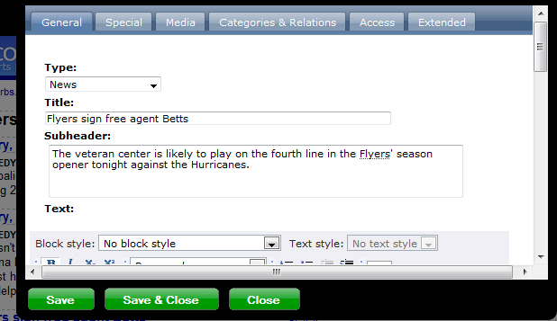

.. ==================================================
.. FOR YOUR INFORMATION
.. --------------------------------------------------
.. -*- coding: utf-8 -*- with BOM.

.. ==================================================
.. DEFINE SOME TEXTROLES
.. --------------------------------------------------
.. role::   underline
.. role::   typoscript(code)
.. role::   ts(typoscript)
   :class:  typoscript
.. role::   php(code)

Use feeditadvanced with any kind of record
------------------------------------------

By default feeditadvanced is configured to be used with normal content
elements coming from the database table tt\_content. You can however
use it with any database table, enabling you to also edit the records
found in those tables with feeditadvanced.

The following text was originally written by `Dan Osipov
<http://danosipov.com/blog/?p=309>`_ .

Here is some simple TypoScript code which you can put into the setup
section of your TypoScript template. It allows you to edit tt\_news
records from the frontend:

::

   plugin.tt_news.displayList.title_stdWrap.editPanel = 1
   plugin.tt_news.displayList.title_stdWrap.editPanel {
     editPanel = 1
     allow = edit,hide,delete
     line = 5
     label = %s
     onlyCurrentPid = 0
     previewBorder = 4
     edit.displayRecord = 1
   }

Here is what you will see in the frontend, next to each tt\_news title
marker:

And if you click edit, you will get the editing form from
feeditadvanced allowing you to modify the record:

Generally, any record which has stdWrap properties can be wrapped in
this code to enable FE editing.

